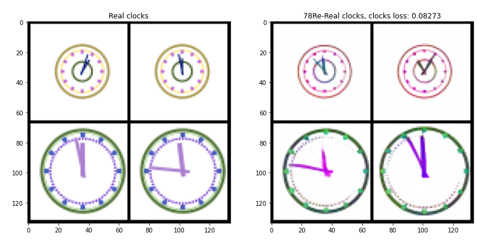

##GAN (last worked on MAY 2021): 

I crafted a synthetic clock dataset and trained a WGAN on it to generate synthetic clocks. During my experimentation, I attempted to change the time and style of a clock. 

I succeeded in doing so as demonstrated here:

Left figure shows generated clocks and in right figure I swap the time in clocks in 1st and 2nd column. I discovered that there are more advanced methods, such as Nvidia's StyleGANs, which have surpassed my work and have access to significantly more GPUs. 

A presentation covering GANs, compiled by me, till StyleGAN is [here](https://docs.google.com/presentation/d/15NaaU3NCRqqne21jq_sFMC7SxHamAp1cE993oeykLBM/edit).
